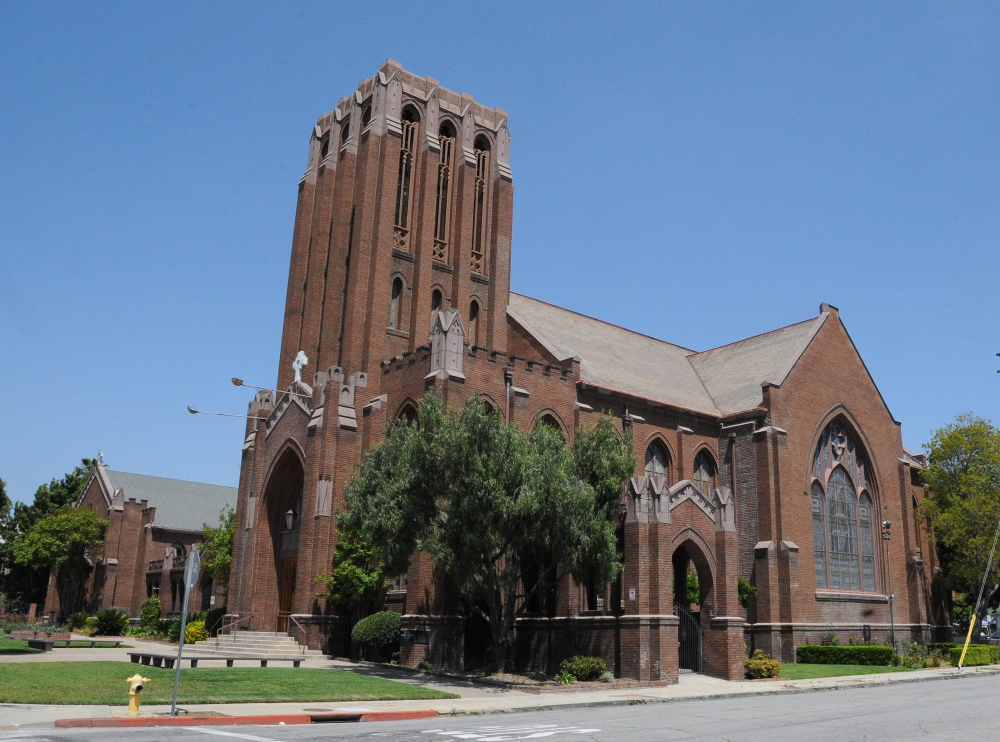
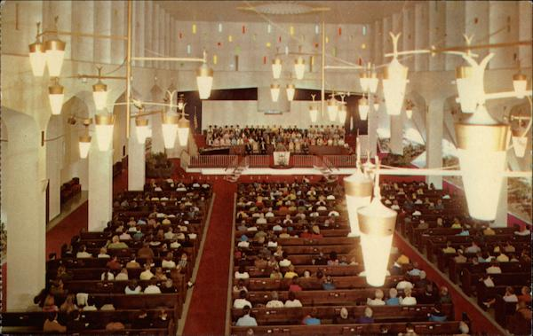
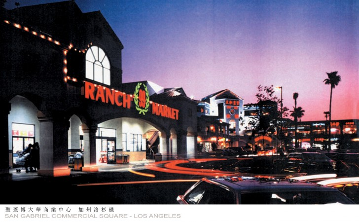

On Saturday, April 10, we drove to see kitchen cabinets at a warehouse in Pomona. My dad had scheduled an appointment with them via a manufacturer online, US Kitchen Cabinet Mall, that was clearly run by non-native English speakers. "Schedule an appointments to vite us", their website declared. We left Santa Barbara around 8:30 and the sky was still washed in a layer of white mist on the drive south, the sun hot and shining and the world too bright for the eyes. We drove through that familiar stretch of the 101, the Camino Real of the Spanish missionaries: the sparsely populated span of Summerland and Carpinteria, the expansive view of the sea west of La Conchita, the vast shopping plazas and agricultural land of Ventura, Oxnard, and Camarillo, the steep rise of the Conejo Grade, the car dealerships and identical new stucco houses of Thousand Oaks and Calabasas, and finally the automobile urbanism of the Los Angeles metropolitan area, where we followed the 101 down the Hollywood Freeway at the Hollywood Split and merged onto the San Bernardino Freeway, Interstate 10, at the San Bernardino Split. 

The area of Pomona we exited into, driving south down Garey Avenue, consisted of unremarkable low-rise cinderblock storefronts, the way most of Los Angeles County is. To our left was the Lincoln Park Historic District, an old residential neighborhood built from the 1890s to the 1940s. We didn't drive in, but on Google Street View it looks remarkably un-Californian, a neighborhood that you would expect to find back east: wide flat roads, old trees and buildings, hardly a Spanish revival house. What we did see was the towering gothic revival Pilgrim Congregational Church, designed by the local architect [Robert Hall Orr](http://pcad.lib.washington.edu/person/874/) and dedicated in 1912, dark and glorious amid all the small cinderblock buildings, and across from it, Purpose Church, which started out as the First Baptist Church of Pomona but has adopted the corporate language of contemporary non-denominational churches since, moving in to its current modernist concrete building in 1987 and assuming the new name with its abstract logo and sans-serif wordmark [in 2015](https://www.dailybulletin.com/2015/10/13/pomona-first-baptist-goes-modern-as-purpose-church/). Further south, we passed the former Pomona YMCA Building, a stately brick building also designed by Robert Hall Orr and completed in 1922; listed on the National Register of Historic Places in 1986; and [recently bought and redeveloped](https://www.dailybulletin.com/2017/08/15/former-pomona-valley-ymca-buildings-new-owner-has-big-plans-for-historic-structure/) by [Spectra Company](https://spectracompany.com/), a large historical preservation firm headquartered in Pomona that worked on Hearst Castle, the Santa Barbara Mission, and Union Station, among many other buildings. We turned east at Monterey Avenue, where the four-story [developer chic](https://commonedge.org/architecture-aesthetic-moralism-and-the-crisis-of-urban-housing/) Monterey Station Apartments, built in 2014 and now owned by Clarion Management of Irvine after changing hands many times, loomed above us. This stretch of Monterey Avenue, despite its width, was mostly a residential street, the southern edge of a poorer neighborhood: the small houses were often beautifully designed with well maintained gardens, but the city had planted very few trees, the cars were old, and many of the houses were surrounded by chain link fences. The street was entirely desolate, with the occasional car or bicyclist passing by as we parked next to the nondescript warehouse building with boarded windows and waited for our hosts to come. 

<figure>
    
    <figcaption>
        Pilgrim Congregational Church, Pomona, designed by Robert Hall Orr. Photograph <a href="https://commons.wikimedia.org/wiki/File:LINCOLN_PARK_H.D.,_POMONA_LOS_ANGELES_COUNTY_CA.jpg">from Wikimedia Commons</a>, April 2020.
    </figcaption>
</figure>

A young Korean man perhaps in his early thirties, who introduced himself as the husband of our contact, opened the gate for us, chasing away and sequestering the two dogs that guarded the door before letting us in. His wife Sherry soon arrived, a Northern Chinese or possibly Korean woman who was just as young and wearing a black hoodie and black workout leggings. She answered our questions in Mandarin in a perfect putonghua accent, listing dimensions from memory and speaking of "drawer bases" and "refrigerator cabinets" and "toe kicks". She showed us their selection: frameless contemporary-style cabinets in particle board, whose doors she warned us would sag if used often, and framed Shaker-style cabinets in plywood. If they didn't have what we wanted in stock, she said, it would be impossible to know when it would arrive, as virus-related labor shortages and extraordinary import volumes from increased consumer shopping had been causing delays at the Port of Long Beach since the end of last year. 

On our way back to the freeway we passed two Korean churches: the Namgajoo Fellowship Church at the corner of Monterey and Towne Avenue, which looked to be housed in a former strip mall building, and on Towne, near the freeway, the Covenant United Methodist Church, whose white-steepled traditional American church building, [constructed in 1953](https://www.countyoffice.org/property-records-search/?q=1750+North+Towne+Avenue%2C+Pomona%2C+CA%2C+USA), must have preceded its current incarnation as a Korean church. I wondered if the Korean population had grown since the 2010 census, which listed Pomona as 8.5 percent Asian, or about 12,700 people. Across from Covenant United, a couple parcels to the west, was the Central Baptist Church, which I didn't notice but should've been visible in the distance: a [spectacular white concrete structure](https://www.roadarch.com/modarch/cachurch9.html) consisting of a scalloped box with small, colorful stained glass perforations perched on a sloped base and topped with a pinnacle, and with a [beautiful interior](http://content.ci.pomona.ca.us/cdm4/results.php?CISOOP1=all&CISOBOX1=Religious+Architecture&CISOFIELD1=publia&CISOOP2=all&CISOBOX2=architecture&CISOFIELD2=creato&CISOOP3=all&CISOBOX3=central+baptist+church+395+san+bernardino+rd%2C+pomona%2C+california%2C+91764&CISOFIELD3=publis&CISOROOT=/PubArt&t=s) as well. 

<figure>
    
    <figcaption>
        Interior of the Central Baptist Church, Pomona, from <a href="https://www.cardcow.com/223013/pomona-california-central-baptist-church/">an old souvenir card</a>. 
    </figcaption>
</figure>

Back on the San Bernardino Freeway we were confronted again by the view of strip malls, gym chains (we passed two or three LA Fitness locations), and developer postmodern hotel buildings, often hidden behind the Southern Californian freeway soundwalls of brown textured cinderblocks. We exited in San Gabriel at Del Mar Avenue, drove past the few car repair shops with signs in Chinese and Vietnamese, and arrived at our next stop: San Gabriel Square, or Focus Plaza, on Valley Boulevard, perhaps [the most famous Chinese shopping mall in California](https://www.latimes.com/local/la-me-san-gabriel-20140213-story.html). A towering postmodern sprawl in pink and yellow stucco, it opened in 1990 on the former site of the [Edwards San Gabriel Drive-In Theatre](http://cinematreasures.org/theaters/2416) and features the four-story Focus Department Store in the center flanked by a 99 Ranch Market to its left and a two-story walkway of restaurants, jewelers, apothecaries, and boba shops to its right. The building complex is McMansionesque in its extravagance, and it would be decidedly awful if it didn't feel so new and foreign, like nothing else in the world: a vast Californian strip mall with acrylic channel-letter signs in Chinese script that glow at night against the stucco mouldings. It was designed by [Simon Dong-Tsair Lee](http://slarch.com/principal-simon-lee-aia/), a Taiwanese American architect who attended [Chinese Culture University](https://en.wikipedia.org/wiki/Chinese_Culture_University) in Shilin District, Taipei—itself a sort of "postmodern" campus, consisting of multi-story modern steel and concrete buildings with traditional Chinese roofs and details—before coming to California to complete a Masters in Architecture at UCLA in 1980 and starting his firm in 1983. His own office is now inside Focus Plaza, and he has since worked on multiple projects for ethnic Chinese clients in the United States and China, mostly in the same garish postmodern style. By the time Focus Plaza opened Valley Boulevard was [already famous for its Chinese food](https://www.latimes.com/archives/la-xpm-1989-01-29-ca-1623-story.html), and the vast new shopping complex was the first in a series of largescale developments in the coming decades, including Sunny Plaza (1996) down the road and Hilton Plaza (2003) and Hilton Hotel (2004) across the way, all developed by the local company [Kengo](http://www.kengoson.com/) in a similar postmodern stucco style with exaggerated references to European architecture. 

<figure>
    
    <figcaption>
        Focus Plaza, San Gabriel, designed by Simon Lee. Photograph <a href="http://slarch.com/our-projects/">from the architect's website</a>, likely taken soon after its completion in 1990. 
    </figcaption>
</figure>

We ate at Vege Paradise, a vegetarian Chinese restaurant at the right end of Focus Plaza that we've frequented ever since it opened in 2008. In response to the coronavirus they had set up outdoor dining tables on the walkway around their octagonal second-floor property and they served everything in disposable containers. We then browsed Daiso, where my mom picked up some specialized Japanese cleaning brushes for tupperware lids, and 99 Ranch, where we bought the usual snacks and cooking supplies: taro, king oyster mushrooms, dougan, unshelled peanuts, sachima, instant noodles, Kadoya sesame oil, and culinary rice wine from the Taiwan Tobacco and Liquor Corporation. Within the past ten years they had remodeled significantly, changing the wall decor and shelving and cleaning up the meat and seafood section in the back. It could have passed for a Whole Foods if the products weren't labeled in various East Asian languages and the store clerks and patrons weren't all Chinese. 

Driving east along Valley Boulevard, we passed the new Sheraton Hotel that opened in 2018 [to attract visitors from China](https://www.latimes.com/business/la-fi-travel-briefcase-sheraton-san-gabriel-20180224-story.html) and the impressive array of Chinese stores, restaurants, and shopping plazas that lined the street, including Sunny Plaza and two other postmodern buildings by Simon Lee: 526 Valley Boulevard, which for many years was a storefront for Besta, one of the foremost Taiwanese electronic dictionary manufacturers, and the corbel-roofed Minh Plaza at 801 Valley Boulevard, which houses a bank and several legal offices. We stopped at a vegetarian supply store in one of the strip malls that we hadn't visited in years to get frozen bags of wheat gluten and tofu skin imported from Taiwan. At Baldwin Avenue, we turned north, passing a residential area and stopping at the Arcadia Center to pick up frozen vegetarian dumplings from a small Taiwanese restaurant, Cozy Cafe. Then we were on our way back, up Baldwin past Westfield Santa Anita and the Arboretum and onto the Foothill Freeway (Interstate 210) followed by our old friend the Ventura Freeway. Along the way we stopped at Harbor Freight Tools and Home Depot in Camarillo and another Harbor Freight in maybe the most architecturally interesting strip mall in Ventura, a place called Victoria Village with a brick-red concrete modernist anchor and wooden vernacular additions, to buy some tools that my father needed for the kitchen remodel.